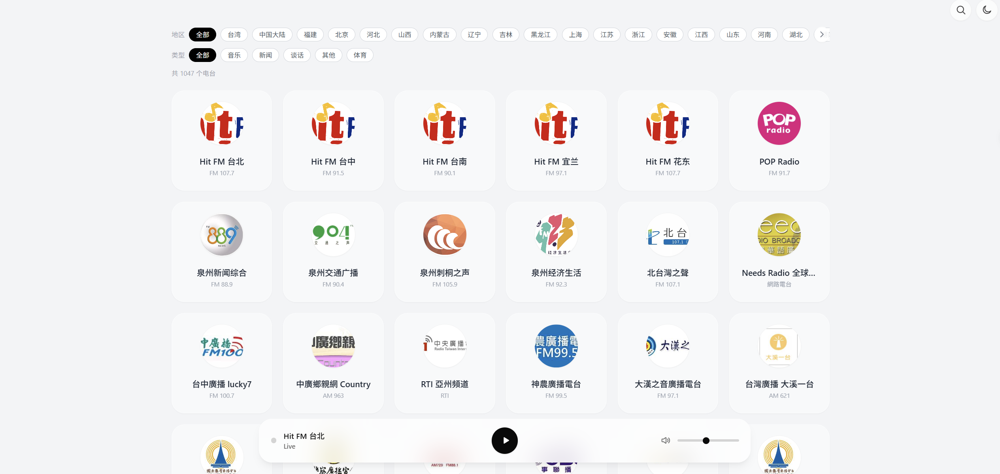
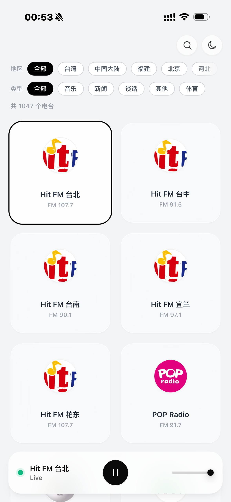
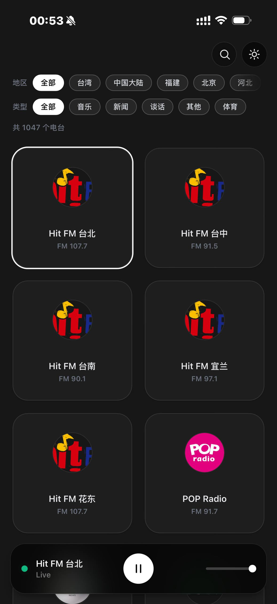

<div align="center">

# 📻 WaveBypass


[](./LICENSE)

**跨地区网络电台聚合网关与现代化 Web 播放器**

WaveBypass 是一个流媒体聚合平台，它通过后端的智能测速与代理，结合前端的响应式 UI，让你在一个页面内流畅收听并管理来自不同国家和地区的优质电台源
</div>


## ✨ 功能特性

- 📻 **台湾/大陆电台**： 可收听大陆及台湾的 1000+ 电台
- ⚡️ **自动路由**：多源冗余，每次发起播放时，后端会并发探测直连和代理线路的连通性，自动路由至最快可用源
- 🛡️ **跨域代理**：针对存在防盗链或 CORS 跨域限制的上游，后端实时接管并重写 m3u8 与 TS 请求，前端免受跨域困扰
- 🎨 **播放体验**： 支持锁屏/线控/车载控制、自适应深色模式
- 📺 **EPG 节目单**：解析云听等公开接口，电台卡片实时展示当前正在播送的节目名称
- 🚧 **可选区域限制**：通过 Cloudflare 请求头中的 IP 归属地，按需屏蔽特定电台
  
## 📸 界面预览

<div align="center">

  
  
  <br> 
  
  
  
</div>

## 📻 支持电台

| 数据源 | 覆盖地区 | 接入策略与说明 |
| :--- | :--- | :--- |
| **云听** | 中国大陆 | 支持**EPG 节目表** |
| **MyRadio** | 台湾 | 第三方聚合，含 90+ 台湾电台 |
| **自适配源** | 大陆/台湾 | 部分特殊电台 |
| **Radio Browser** | 全球 | 社区电台数据库，按国家/地区加载 |

## 🚀 快速开始

#### 🐳 Docker Compose（推荐）

项目已提供 `docker-compose.yml` 示例配置。

进入项目目录后，直接启动：

```bash
docker compose up -d
```

服务启动后：

- 前端默认运行在 `127.0.0.1:80` 端口
- 后端 API 默认运行在 `8000` 端口

如需修改地域限制、Cookie 等配置，请编辑项目根目录下的 `.env.example` 文件并修改为 `.env`

---

#### 🐳 Docker Run（可选）

如果你不使用 Docker Compose，也可以手动启动容器。

<details>
<summary>展开 Docker Run 部署命令</summary>

#### 1. 创建网络

```bash
docker network create wavebypass-net
```

#### 2. 启动后端

```bash
docker run -d \
  --name wavebypass-backend \
  --network wavebypass-net \
  -p 8000:8000 \
  -e HITFM_COOKIE="" \
  -e GEO_RESTRICT="0" \
  -e GEO_BLOCKED_REGIONS="" \
  --restart unless-stopped \
  ghcr.io/amplace/wavebypass-backend:latest
```

#### 3. 启动前端

```bash
docker run -d \
  --name wavebypass-frontend \
  --network wavebypass-net \
  -p 80:80 \
  --restart unless-stopped \
  ghcr.io/amplace/wavebypass-frontend:latest
```

</details>

---

## 💻 源码运行


#### 1. 后端

```bash
git clone https://github.com/amplace/wavebypass.git

cd wavebypass/backend

pip install -r requirements.txt

uvicorn main:app --reload --port 8000
```

#### 2. 前端

```bash
cd ../frontend

npm install

npm run dev
```

> 💡 提示：开发模式下，Vite 已配置本地 Proxy，会自动将前端的 `/api` 请求跨域转发至后端的 `localhost:8000`。

## ⚙️ 环境变量


| 变量名 | 说明 | 默认值 |
|---|---|---|
| `HITFM_COOKIE` | Hit FM 官网 Cookie（可选填写） | 空 |
| `GEO_RESTRICT` | 地域拦截全局开关，设为 `1` 启用拦截 | `0`（关闭） |
| `GEO_BLOCKED_REGIONS` | 地域拦截黑名单标签，需配合上方开关使用，多个地区使用英文逗号分隔 | `TW` |

---

## 🛠️ 技术栈

**前端**：Vue 3 · Pinia · Tailwind CSS · Vite · hls.js  
**后端**：Python 3.10+ · FastAPI · httpx · uvicorn

---

## 🗓️ TODO

- [ ] PWA 支持：可安装桌面/移动端
- [ ] 配置分享：订阅源打包为分享码或链接，支持导入他人配置
- [ ] IPTV 支持： 导入 IPTV 订阅、频道去重、测速，支持前端播放 IPTV ，显示 EPG

  
---

## 📄 License

本项目基于 [AGPL-3.0](./LICENSE) 协议开源。

---

## ⚠️ 免责声明

本项目仅供编程学习与技术交流使用。

项目代码不包含、不托管任何音频流媒体文件，所有电台数据及播放链接均通过网络公开接口聚合抓取。

使用者在使用过程中请遵守所在国家及地区的法律法规。对于因非法收听、录制、传播未经授权内容而引起的任何法律责任，由使用者自行承担，与本项目及开发者无关。